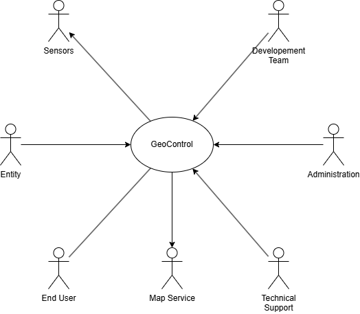
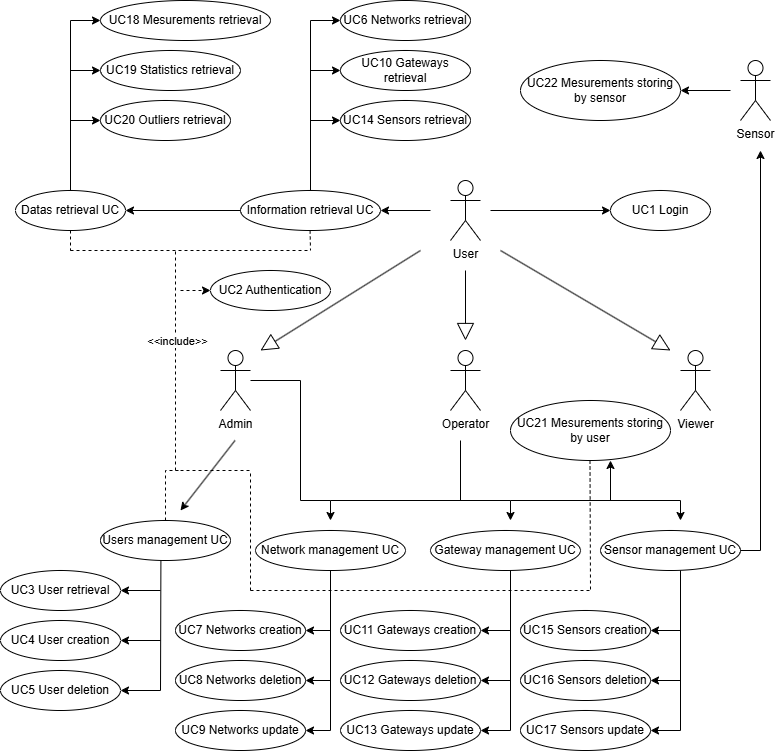
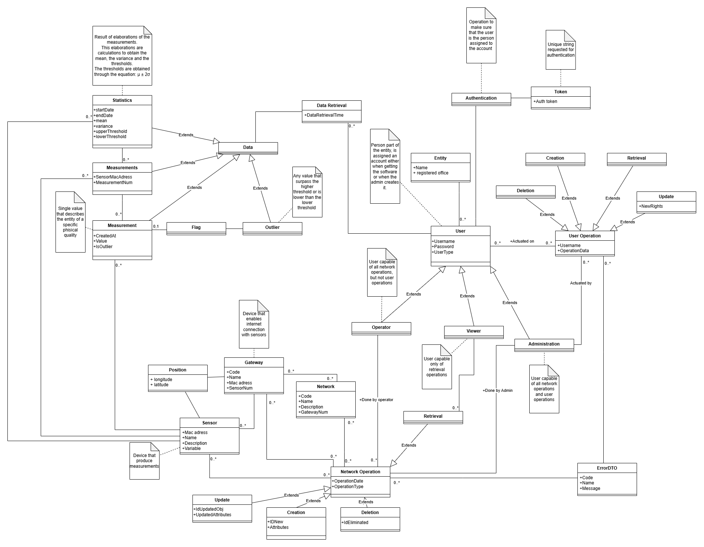
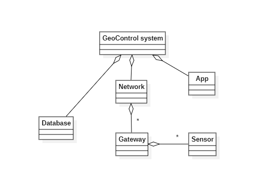

# Requirements Document - GeoControl

Date: 19/04/2025

Version: V1 - description of Geocontrol as described in the swagger

| Version number | Change |
| :------------: | :----: |
|                |        |

# Contents

- [Requirements Document - GeoControl](#requirements-document---geocontrol)
- [Contents](#contents)
- [Informal description](#informal-description)
- [Business Model](#business-model)
- [Stakeholders](#stakeholders)
- [Context Diagram and interfaces](#context-diagram-and-interfaces)
  - [Context Diagram](#context-diagram)
  - [Interfaces](#interfaces)
- [Stories and personas](#stories-and-personas)
  - [Personas](#personas)
  - [Stories](#stories)
- [Functional and non functional requirements](#functional-and-non-functional-requirements)
  - [Functional Requirements](#functional-requirements)
  - [Non Functional Requirements](#non-functional-requirements)
- [Use case diagram and use cases](#use-case-diagram-and-use-cases)
  - [Use case diagram](#use-case-diagram)
    - [Use case 1, Login](#use-case-1-login)
      - [Scenario 1.1 | Nominal](#scenario-11--nominal)
      - [Scenario 1.2 | err : invalid_field](#scenario-12--err--invalid_field)
    - [Use case 2, Authentication](#use-case-2-authentication)
      - [Scenario 2.1 | Nominal](#scenario-21--nominal)
      - [Scenario 2.2 | err : invalid_token](#scenario-22--err--invalid_token)
    - [Use case 3, Retrieval of users](#use-case-3-retrieval-of-users)
      - [Scenario 3.1 | Nominal](#scenario-31--nominal)
      - [Scenario 3.2 | err : insufficient_privileges](#scenario-32--err--insufficient_privileges)
      - [Scenario 3.3 | err : invalid_field](#scenario-33--err--invalid_field)
    - [Use case 4, User creation](#use-case-4-user-creation)
      - [Scenario 4.1 | Nominal](#scenario-41--nominal)
      - [Scenario 4.2 | err : insufficient_privileges](#scenario-42--err--insufficient_privileges)
      - [Scenario 4.3 | err : invalid_field](#scenario-43--err--invalid_field)
    - [Use case 5, User deletion](#use-case-5-user-deletion)
      - [Scenario 5.1 | Nominal](#scenario-51--nominal)
      - [Scenario 5.2 | err : insufficient_privileges](#scenario-52--err--insufficient_privileges)
      - [Scenario 5.3 | err : invalid_field](#scenario-53--err--invalid_field)
    - [Use case 6, Network retrieval](#use-case-6-network-retrieval)
      - [Scenario 6.1 | Nominal](#scenario-61--nominal)
      - [Scenario 6.2 | err : invalid_field](#scenario-62--err--invalid_field)
    - [Use case 7, Network creation](#use-case-7-network-creation)
      - [Scenario 7.1 | Nominal](#scenario-71--nominal)
      - [Scenario 7.2 | err : insufficient_privileges](#scenario-72--err--insufficient_privileges)
      - [Scenario 7.3 | err : invalid_field](#scenario-73--err--invalid_field)
    - [Use case 8, Network deletion](#use-case-8-network-deletion)
      - [Scenario 8.1 | Nominal](#scenario-81--nominal)
      - [Scenario 8.2 | err : insufficient_privileges](#scenario-82--err--insufficient_privileges)
      - [Scenario 8.3 | err : invalid_field](#scenario-83--err--invalid_field)
    - [Use case 9, Network update](#use-case-9-network-update)
      - [Scenario 9.1 | Nominal](#scenario-91--nominal)
      - [Scenario 9.2 | err : insufficient_privileges](#scenario-92--err--insufficient_privileges)
      - [Scenario 9.3 | err : invalid_field](#scenario-93--err--invalid_field)
    - [Use case 10, Gateway retrieval](#use-case-10-gateway-retrieval)
      - [Scenario 10.1 | Nominal](#scenario-101--nominal)
      - [Scenario 10.2 | err : invalid_field](#scenario-102--err--invalid_field)
    - [Use case 11, Gateway creation](#use-case-11-gateway-creation)
      - [Scenario 11.1 | Nominal](#scenario-111--nominal)
      - [Scenario 11.2 | err : insufficient_privileges](#scenario-112--err--insufficient_privileges)
      - [Scenario 11.3 | err : invalid_field](#scenario-113--err--invalid_field)
    - [Use case 12, Gateway deletion](#use-case-12-gateway-deletion)
      - [Scenario 12.1 | Nominal](#scenario-121--nominal)
      - [Scenario 12.2 | err : insufficient_privileges](#scenario-122--err--insufficient_privileges)
      - [Scenario 12.3 | err : invalid_field](#scenario-123--err--invalid_field)
    - [Use case 13, Gateway update](#use-case-13-gateway-update)
      - [Scenario 13.1 | Nominal](#scenario-131--nominal)
      - [Scenario 13.2 | err : insufficient_privileges](#scenario-132--err--insufficient_privileges)
      - [Scenario 13.3 | err : invalid_field](#scenario-133--err--invalid_field)
    - [Use case 14, Sensor retrieval](#use-case-14-sensor-retrieval)
      - [Scenario 14.1 | Nominal](#scenario-141--nominal)
      - [Scenario 14.2 | err : invalid_field](#scenario-142--err--invalid_field)
    - [Use case 15, Sensor creation](#use-case-15-sensor-creation)
      - [Scenario 15.1 | Nominal](#scenario-151--nominal)
      - [Scenario 15.2 | err : insufficient_privileges](#scenario-152--err--insufficient_privileges)
      - [Scenario 15.3 | err : invalid_field](#scenario-153--err--invalid_field)
    - [Use case 16, Sensor deletion](#use-case-16-sensor-deletion)
      - [Scenario 16.1 | Nominal](#scenario-161--nominal)
      - [Scenario 16.2 | err : insufficient_privileges](#scenario-162--err--insufficient_privileges)
      - [Scenario 16.3 | err : invalid_field](#scenario-163--err--invalid_field)
    - [Use case 17, Sensor update](#use-case-17-sensor-update)
      - [Scenario 17.1 | Nominal](#scenario-171--nominal)
      - [Scenario 17.2 | err : insufficient_privileges](#scenario-172--err--insufficient_privileges)
      - [Scenario 17.3 | err : invalid_field](#scenario-173--err--invalid_field)
    - [Use case 18, Measurements retrieval](#use-case-18-measurements-retrieval)
      - [Scenario 18.1 | Nominal](#scenario-181--nominal)
      - [Scenario 18.2 | err : invalid_field](#scenario-182--err--invalid_field)
    - [Use case 19, Statistics retrieval](#use-case-19-statistics-retrieval)
      - [Scenario 19.1 | Nominal](#scenario-191--nominal)
      - [Scenario 19.2 | err : invalid_field](#scenario-192--err--invalid_field)
    - [Use case 20, Outliers retrieval](#use-case-20-outliers-retrieval)
      - [Scenario 20.1 | Nominal](#scenario-201--nominal)
      - [Scenario 20.2 | err : invalid_field](#scenario-202--err--invalid_field)
    - [Use case 21, Measurements storing by user](#use-case-21-measurements-storing-by-user)
      - [Scenario 21.1 | Nominal](#scenario-211--nominal)
      - [Scenario 21.2 | err : insufficient_privileges](#scenario-212--err--insufficient_privileges)
      - [Scenario 21.3 | err : invalid_field](#scenario-213--err--invalid_field)
    - [Use case 22, Measurements storing by sensor](#use-case-22-measurements-storing-by-sensor)
      - [Scenario 22.1 | Nominal](#scenario-221--nominal)
      - [Scenario 22.2 | err : server_not_reachable](#scenario-222--err--server_not_reachable)
      - [Scenario 22.3 | err : information_loss](#scenario-223--err--information_loss)
- [Glossary](#glossary)
- [System Design](#system-design)
- [Deployment Diagram](#deployment-diagram)

# Informal description

GeoControl is a software system designed for monitoring physical and environmental variables in various contexts: from hydrogeological analyses of mountain areas to the surveillance of historical buildings, and even the control of internal parameters (such as temperature or lighting) in residential or working environments.

# Business Model

## Plan based solution

A solution that allows private and public entities to select a tailored business plan for utilizing the GeoControl software. Following an initial payment for the infrastructure setup, the chosen plan includes a monthly subscription that provides periodic software updates and comprehensive maintenance services. This ensures the entity benefits from a continuously optimized system and reliable technical support.

# Stakeholders

|             Stakeholder Name             | Description                                                                                                       |
| :--------------------------------------: | :---------------------------------------------------------------------------------------------------------------- |
| Union of Mountain Community of Piedmont | Commissioned the API                                                                                              |
|                  Entity                  | Buys the service provided. Can either be private or public                                                        |
|                   User                   | Utilizes the API                                                                                                  |
|              Administration              | Monitors the application and manages security                                                                     |
|                 Sensors                  | Provide measurements                                                                                              |
|            Development Team              | Implements the account management and the calculus software definitions of the software                           |
|             Marketing Office             | Based on the requirements needed for an entity, defines the payment plan                                          |
|            Technical Support             | Provides maintenance and technical support for the API                                                            |
|               Map Service                | Provides geographical maps                                                                                        |
|            Database Providers            | Provide the infrastructure for the database for storing all the necessary data (accounts, measurements, statistics) |

# Context Diagram and interfaces

## Context Diagram

## Interfaces

|       Actor       |      Physical Interface       |  Logical Interface  |
| :---------------: | :---------------------------: | :-----------------: |
|      Sensor       |            Gateway            |      [-5V, 5V]      |
|  Administration   |              PC               |         GUI         |
|       User        |        PC, Smartphone         |         GUI         |
|      Entity       |       Marketing Offfice       |      Contract       |
| Technical Support | USB port type A and log files | Diagnostic firmware |
| Development Team  |              PC               |       Coding        |
|    Map service    |      Internet connection      | Api specifications  |

# Stories and personas

## Personas

Name: Stefano Paolo Corgnati 
Age: 52 
Job Role: Rector 
Goal: Provide software infrastructure to the university’s employees/research 
Technical Proficiency: Intermediate 

Name: Silvia Luciani 
Age: 35 
Job Role: Technical Support 
Account Role: Admin 
Goal: Maintain the correct functionality of the network and decide account class policies 
Technical Proficiency: High 

Name: Dario Corradi 
Age: 29 
Job Role: Researcher 
Account Role: Operator 
Goal: Make new discoveries by analyzing measurements/practical test results 
Technical Proficiency: Intermediate 

Name: Francesco Rossi 
Age: 21 
Job Role: Student 
Account Role: Viewer 
Goal: Learn course knowledge by applying it in simplified field research 
Technical Proficiency: Low 

## Stories

“As a rector, I want a responsive line of communication with the API’s customer support so that my employees can easily report malfunctions in the system.”

“As technical support, I want to check the sensor activities so that I can have a faster response time to any failure.”

“As technical support, I want to be able to modify account rights so that it is possible to adapt to a change in the organogram of the university.”

“As a researcher, I want to be able to change the gateway grouping so that I can have more detailed studies in specific locations.”

“As a student, I want to filter the typology of data so that I can focus on a particular aspect of data to study.”

## Functional Requirements

|    ID    |                                    Description                                    |
| :------: | :-------------------------------------------------------------------------------: |
| **FR 1** |           **Authorization and authentication, account classification**            |
|          |                                                                                   |
|          |                            **_FR 1.1 for all users_**                             |
|  1.1.1   |                                      Log in                                       |
|  1.1.2   |                                      Log out                                      |
|  1.1.3   |                                  Change password                                  |
|          |                                                                                   |
|          |                      **_FR 1.2 for users with admin role_**                       |
|  1.2.1   |       Create a new user for the same belonging entity as the admin role user      |
|  1.2.2   |     Delete a specific user for the same belonging entity as the admin role user   |
|  1.2.3   |    Retrieve all users list of the same belonging entity as the admin role user    |
|  1.2.4   |   Retrieve a specific user of the same belonging entity as the admin role user    |
|  1.2.5   | Modify specific user rights of the same belonging entity as the admin role user   |
|          |                                                                                   |
|          |                                                                                   |
| **FR 2** |                                **Manage networks**                                |
|   2.1    |                                 Create a network                                  |
|   2.2    |                                 Delete a network                                  |
|   2.3    |                           Retrieve all entity networks                            |
|   2.4    |                             Retrieve a specific network                           |
|   2.5    |                                 Update a network                                  |
|          |                                                                                   |
|          |                                                                                   |
| **FR 3** |                               **Manage gateways**                                 |
|   3.1    |                        Create a new gateway for a network                         |
|   3.2    |                                 Delete a gateway                                  |
|   3.3    |                     Retrieve all network-associated gateways                      |
|   3.4    |                             Retrieve a specific gateway                           |
|   3.5    |                                 Update a gateway                                  |
|          |                                                                                   |
|          |                                                                                   |
| **FR 4** |                                **Manage sensors**                                 |
|   4.1    |                         Create a new sensor for a gateway                         |
|   4.2    |                                  Delete a sensor                                  |
|   4.3    |                      Retrieve all gateway-associated sensors                      |
|   4.4    |                             Retrieve a specific sensor                            |
|   4.5    |                                  Update a sensor                                  |
|          |                                                                                   |
|          |                                                                                   |
| **FR 5** |                   **Manage sensor measurements and statistics**                   |
|   5.1    |                    Retrieve measurements from a specific sensor                   |
|   5.2    |                    Retrieve statistics from a specific sensor                     |
|   5.3    |               Retrieve outlier measurements from a specific sensor                |
|   5.4    |          Retrieve measurements for sensors belonging to a specific network        |
|   5.5    |          Retrieve statistics for sensors belonging to a specific network          |
|   5.6    |     Retrieve outlier measurements for sensors belonging to a specific network     |
|   5.7    |                          Store measurements from a sensor                         |
|          |                                                                                   |
|          |                                                                                   |
| **FR 6** |                            **Manage geographic data**                             |
|   6.1    |                                 Request map tile                                  |
|   6.2    |                                   Show map tile                                   |
|   6.3    |                            Overlay entities on the map                            |
|  6.3.1   |                        Show selected entities measurements                        |
|  6.3.2   |                         Show selected entities statistics                         |

## Non-Functional Requirements

|    ID     | Type (efficiency, reliability, ..) |                                                               Description                                                                |                       Refers to                        |
| :-------: | :--------------------------------: | :--------------------------------------------------------------------------------------------------------------------------------------: | :----------------------------------------------------: |
| NFR 1.1.1 |             Usability              |  Time to log in and find the measurements, statistics, or outliers needed for a new user < 10min for users who use PC/smartphone for > 1yr  |                    FR 1.1.1 - FR 5                     |
| NFR 1.1.2 |             Usability              | Time to log in and find the measurements, statistics, or outliers needed for users who already used the software > 1 month should be < 2min |                    FR 1.1.1 - FR 5                     |
|  NFR 1.2  |             Usability              |                              Time to download the software and connect it to the entity network < 15min                               |                                                        |
|  NFR 1.3  |             Usability              |                 Creation, updating, and removal of networks, gateways, and sensors, reflecting any field changes < 5min                  |    FR 2.1/2.2/2.5 - FR 3.1/3.2/3.5 - FR 4.1/4.2/4.5    |
|  NFR 2.1  |             Efficiency             |                                                Response time for the data needed < 10sec                                                 |                    FR 5 except 5.7                     |
| NFR 2.2.1 |             Efficiency             |                                               Size of the software to download (PC) < 1GB                                                |                                                        |
| NFR 2.2.2 |             Efficiency             |                                          Size of the software to download (Smartphone) < 100MB                                           |                                                        |
|  NFR 3.1  |            Reliability             |                                         No more than 6 measurements per year per sensor are lost                                          |                          FR 5                          |
|  NFR 3.2  |            Reliability             |                            Credentials and authentication databases should be available 99.99% of the time per year                             |                          FR 1                          |
|  NFR 4.1  |          Maintainability           |                                            The periodical update of the API should take < 5min                                            |                                                        |
|  NFR 5.1  |              Security              |                  User credentials should not be accessible except to the admin role or the Administrator of GeoControl                   |                         FR 1.1                         |
|  NFR 5.2  |              Security              |                                 Admin role should only be able to manage users and networks of their own entity                                  |              FR 1.2 - FR 2 - FR 3 - FR 4               |
|  NFR 5.3  |              Security              |                         Operator role should only be able to manage networks, gateways, sensors, and measurements                         |                   FR 2 - FR 3 - FR 4                   |
|  NFR 5.4  |              Security              |            Viewer role should only be allowed to use read-only operations on networks, gateways, sensors, and measurements            | FR 2.2/2.3 - FR 3.2/3.3 - FR 4.2/4.3 - FR 5 except 5.7 |
| NFR 6.1 | Portability | The application must be compatible with web browsers (Chrome, Firefox, Safari, Edge latest versions) and native platforms, including Windows 10+, Ubuntu 20.04+ LTS, iOS 12+, and Android 11+. | |
| NFR 6.2 | Portability | The API must integrate with third-party systems (e.g., mapping services or external databases) to manage sensor measurements and statistics. | FR 5 |
| NFR 6.3 | Portability | Data collected from sensors must be exportable in standard formats (e.g., CSV, JSON, GeoJSON) and readable on other platforms. | FR 5 |

# Use case diagram and use cases

## Use case diagram

### Use case 1, Login

| Actors Involved  |                                   User                                    |
| :--------------: | :-----------------------------------------------------------------------: |
|   Precondition   |                        User already has an account                        |
|  Post condition  |                        User successfully logged in                        |
| Nominal Scenario | The user inserts their credentials and retrieves the authentication token |
|     Variants     |                                   none                                    |
|    Exceptions    |                       Invalid username or password                        |

##### Scenario 1.1 | Nominal

| Step# |                                   Description                                   |
| :---: | :-----------------------------------------------------------------------------: |
|   1   |                          The user opens the login page                          |
|   2   |                           The system returns the page                           |
|   3   | The user sends a `POST /auth` request to the server with the filled credentials |
|   4   |        The system issues the authentication token to be used by the user        |

##### Scenario 1.2 | err : invalid_field

| Step# |                                   Description                                   |
| :---: | :-----------------------------------------------------------------------------: |
|   1   |                          The user opens the login page                          |
|   2   |                           The system returns the page                           |
|   3   | The user sends a `POST /auth` request to the server with the filled credentials |
|   4   |         The system notifies that the password or the email is incorrect         |

### Use case 2, Authentication

| Actors Involved  |                    User                     |
| :--------------: | :-----------------------------------------: |
|   Precondition   | User wants to perform an action on the API  |
|  Post condition  |        Action successfully performed        |
| Nominal Scenario | The user submits their authentication token |
|     Variants     |                    none                     |
|    Exceptions    |                Invalid token                |

##### Scenario 2.1 | Nominal

| Step# |                     Description                      |
| :---: | :--------------------------------------------------: |
|   1   |      The user performs a request to the server       |
|   2   |     The system asks for the authentication token     |
|   3   |     The user inserts their authentication token      |
|   4   | The system performs the action requested by the user |

##### Scenario 2.2 | err : invalid_token

| Step# |                         Description                          |
| :---: | :----------------------------------------------------------: |
|   1   |          The user performs a request to the server           |
|   2   |         The system asks for the authentication token         |
|   3   |         The user inserts their authentication token          |
|   4   | The system notifies that the authentication token is invalid |

### Use case 3, User retrieval

| Actors Involved  |                                          User                                           |
| :--------------: | :-------------------------------------------------------------------------------------: |
|   Precondition   |            User with admin wants to retrieve the information about any users            |
|  Post condition  |                        List of selected users shown to the user                         |
| Nominal Scenario | The user with admin privileges fills the form and retrieves information about 1-N users |
|     Variants     |                                          none                                           |
|    Exceptions    |                         The user doesn't have enough privileges                         |
|                  |              An inserted field is invalid (e.g., username not found, ...)               |
|                  |                                Invalid token _(see UC2)_                                |

##### Scenario 3.1 | Nominal

| Step# |                                          Description                                           |
| :---: | :--------------------------------------------------------------------------------------------: |
|   1   | The user with admin role sends a `GET /users` or `GET /users/{userName}` request to the server |
|   2   |                          The system asks for the authentication token                          |
|   3   |                          The user inserts their authentication token                           |
|   4   |                The system returns a list of users matching the specified field                 |

##### Scenario 3.2 | err : insufficient_privileges

| Step# |                                            Description                                            |
| :---: | :-----------------------------------------------------------------------------------------------: |
|   1   | The user without admin role sends a `GET /users` or `GET /users/{userName}` request to the server |
|   2   |            The system notifies that they have insufficient privileges for that action             |

##### Scenario 3.3 | err : invalid_field

| Step# |                                  Description                                   |
| :---: | :----------------------------------------------------------------------------: |
|   1   | The user with admin role sends a `GET /users/{userName}` request to the server |
|   2   |                  The system asks for the authentication token                  |
|   3   |          The user with admin role inserts their authentication token           |
|   4   | The system notifies the user that no user matching the specified field exists  |

### Use case 4, User creation

| Actors Involved  |                                                         User                                                         |
| :--------------: | :------------------------------------------------------------------------------------------------------------------: |
|   Precondition   |                                         Another user doesn't have an account                                         |
|  Post condition  |                                 That user now has an account with their credentials                                  |
| Nominal Scenario | The user with admin role inserts the required credentials and the granted privileges for the new account of the user |
|     Variants     |                                                         none                                                         |
|    Exceptions    |                          The user who's creating the account doesn't have enough privileges                          |
|                  |           An inserted field is invalid (e.g., username already exists, password isn't strong enough, ...)            |
|                  |                                              Invalid token _(see UC2)_                                               |

##### Scenario 4.1 | Nominal

| Step# |                                            Description                                            |
| :---: | :-----------------------------------------------------------------------------------------------: |
|   1   | The user with admin role sends a `POST /users` request to the server with the required parameters |
|   2   |                           The system asks for the authentication token                            |
|   3   |                            The user inserts their authentication token                            |
|   4   |                    The system notifies the successful creation of the account                     |

##### Scenario 4.2 | err : insufficient_privileges

| Step# |                                             Description                                              |
| :---: | :--------------------------------------------------------------------------------------------------: |
|   1   | The user without admin role sends a `POST /users` request to the server with the required parameters |
|   2   |              The system notifies that they have insufficient privileges for that action              |

##### Scenario 4.3 | err : invalid_field

| Step# |                                            Description                                            |
| :---: | :-----------------------------------------------------------------------------------------------: |
|   1   | The user with admin role sends a `POST /users` request to the server with the required parameters |
|   2   |                           The system asks for the authentication token                            |
|   3   |                            The user inserts their authentication token                            |
|   4   |                 The system notifies that a field is invalid, specifying the issue                 |

### Use case 5, User deletion

| Actors Involved  |                                     User                                     |
| :--------------: | :--------------------------------------------------------------------------: |
|   Precondition   |                     User wants to delete a user account                      |
|  Post condition  |                        The user account gets deleted                         |
| Nominal Scenario | The user inserts the username of the user they want to delete and deletes it |
|     Variants     |                                     none                                     |
|    Exceptions    |                   The user doesn't have enough privileges                    |
|                  |         An inserted field is invalid (e.g., username not found, ...)         |
|                  |                          Invalid token _(see UC2)_                           |

##### Scenario 5.1 | Nominal

| Step# |                                    Description                                    |
| :---: | :-------------------------------------------------------------------------------: |
|   1   | The user with admin role sends a `DELETE /users/{userName}` request to the server |
|   2   |                   The system asks for the authentication token                    |
|   3   |                    The user inserts their authentication token                    |
|   4   | The system notifies that the specified user account has been successfully deleted |

##### Scenario 5.2 | err : insufficient_privileges

| Step# |                                     Description                                      |
| :---: | :----------------------------------------------------------------------------------: |
|   1   | The user without admin role sends a `DELETE /users/{userName}` request to the server |
|   2   |      The system notifies that they have insufficient privileges for that action      |

##### Scenario 5.3 | err : invalid_field

| Step# |                                    Description                                    |
| :---: | :-------------------------------------------------------------------------------: |
|   1   | The user with admin role sends a `DELETE /users/{userName}` request to the server |
|   2   |                   The system asks for the authentication token                    |
|   3   |                    The user inserts their authentication token                    |
|   4   |         The system notifies that a field is invalid, specifying the issue         |

### Use case 6, Network retrieval

| Actors Involved  |                                     User                                     |
| :--------------: | :--------------------------------------------------------------------------: |
|   Precondition   |           The user wants to retrieve the components of any network           |
|  Post condition  |           The user can access all the specified network components           |
| Nominal Scenario | The user can insert a specified network code or not to retrieve 1-N networks |
|     Variants     |                                     none                                     |
|    Exceptions    |       An inserted field is invalid (e.g., network code not found, ...)       |
|                  |                          Invalid token _(see UC2)_                           |

##### Scenario 6.1 | Nominal

| Step# |                                       Description                                       |
| :---: | :-------------------------------------------------------------------------------------: |
|   1   | The user sends a `GET /networks` or `GET /networks/{networkCode}` request to the server |
|   2   |                      The system asks for the authentication token                       |
|   3   |                       The user inserts their authentication token                       |
|   4   |           The system returns the list of matching networks with their details           |

##### Scenario 6.2 | err : invalid_field

| Step# |                             Description                              |
| :---: | :------------------------------------------------------------------: |
|   1   | The user sends a `GET /networks/{networkCode}` request to the server |
|   2   |             The system asks for the authentication token             |
|   3   |             The user inserts their authentication token              |
|   4   |  The system notifies that a field is invalid, specifying the issue   |

### Use case 7, Network creation

| Actors Involved  |                                 User                                  |
| :--------------: | :-------------------------------------------------------------------: |
|   Precondition   |                The user wants to create a new network                 |
|  Post condition  |               The network has been successfully created               |
| Nominal Scenario |   The user inserts the network information and creates the network    |
|     Variants     |                                 none                                  |
|    Exceptions    |                The user doesn't have enough privileges                |
|                  | An inserted field is invalid (e.g., network code already exists, ...) |
|                  |                       Invalid token _(see UC2)_                       |

##### Scenario 7.1 | Nominal

| Step# |                                                   Description                                                    |
| :---: | :--------------------------------------------------------------------------------------------------------------: |
|   1   | The user with admin or operator role sends a `POST /networks` request to the server with the required parameters |
|   2   |                                   The system asks for the authentication token                                   |
|   3   |                                   The user inserts their authentication token                                    |
|   4   |                            The system notifies the successful creation of the network                            |

##### Scenario 7.2 | err : insufficient_privileges

| Step# |                                                     Description                                                     |
| :---: | :-----------------------------------------------------------------------------------------------------------------: |
|   1   | The user without admin or operator role sends a `POST /networks` request to the server with the required parameters |
|   2   |                     The system notifies that they have insufficient privileges for that action                      |

##### Scenario 7.3 | err : invalid_field

| Step# |                                                   Description                                                    |
| :---: | :--------------------------------------------------------------------------------------------------------------: |
|   1   | The user with admin or operator role sends a `POST /networks` request to the server with the required parameters |
|   2   |                                   The system asks for the authentication token                                   |
|   3   |                                   The user inserts their authentication token                                    |
|   4   |                        The system notifies that a field is invalid, specifying the issue                         |

### Use case 8, Network deletion

| Actors Involved  |                               User                               |
| :--------------: | :--------------------------------------------------------------: |
|   Precondition   |                The user wants to delete a network                |
|  Post condition  |            The network has been successfully deleted             |
| Nominal Scenario | The user inserts the network information and deletes the network |
|     Variants     |                               none                               |
|    Exceptions    |             The user doesn't have enough privileges              |
|                  | An inserted field is invalid (e.g., network code not found, ...) |
|                  |                    Invalid token _(see UC2)_                     |

##### Scenario 8.1 | Nominal

| Step# |                                             Description                                             |
| :---: | :-------------------------------------------------------------------------------------------------: |
|   1   | The user with admin or operator role sends a `DELETE /networks/{networkCode}` request to the server |
|   2   |                            The system asks for the authentication token                             |
|   3   |                             The user inserts their authentication token                             |
|   4   |                     The system notifies the successful deletion of the network                      |

##### Scenario 8.2 | err : insufficient_privileges

| Step# |                                              Description                                               |
| :---: | :----------------------------------------------------------------------------------------------------: |
|   1   | The user without admin or operator role sends a `DELETE /networks/{networkCode}` request to the server |
|   2   |               The system notifies that they have insufficient privileges for that action               |

##### Scenario 8.3 | err : invalid_field

| Step# |                                             Description                                             |
| :---: | :-------------------------------------------------------------------------------------------------: |
|   1   | The user with admin or operator role sends a `DELETE /networks/{networkCode}` request to the server |
|   2   |                            The system asks for the authentication token                             |
|   3   |                             The user inserts their authentication token                             |
|   4   |                  The system notifies that a field is invalid, specifying the issue                  |

### Use case 9, Network update

| Actors Involved  |                                               User                                               |
| :--------------: | :----------------------------------------------------------------------------------------------: |
|   Precondition   |                                The user wants to update a network                                |
|  Post condition  |                            The network has been successfully updated                             |
| Nominal Scenario |                 The user inserts the network information and updates the network                 |
|     Variants     |                                               none                                               |
|    Exceptions    |                             The user doesn't have enough privileges                              |
|                  | An inserted field is invalid (e.g., network code not found, new network code already exists ...) |
|                  |                                    Invalid token _(see UC2)_                                     |

##### Scenario 9.1 | Nominal

| Step# |                                                            Description                                                            |
| :---: | :-------------------------------------------------------------------------------------------------------------------------------: |
|   1   | The user with admin or operator role sends an `UPDATE /networks/{networkCode}` request to the server with the required parameters |
|   2   |                                           The system asks for the authentication token                                            |
|   3   |                                            The user inserts their authentication token                                            |
|   4   |                                     The system notifies the successful update of the network                                      |

##### Scenario 9.2 | err : insufficient_privileges

| Step# |                                                             Description                                                              |
| :---: | :----------------------------------------------------------------------------------------------------------------------------------: |
|   1   | The user without admin or operator role sends an `UPDATE /networks/{networkCode}` request to the server with the required parameters |
|   2   |                              The system notifies that they have insufficient privileges for that action                              |

##### Scenario 9.3 | err : invalid_field

| Step# |                                                            Description                                                            |
| :---: | :-------------------------------------------------------------------------------------------------------------------------------: |
|   1   | The user with admin or operator role sends an `UPDATE /networks/{networkCode}` request to the server with the required parameters |
|   2   |                                           The system asks for the authentication token                                            |
|   3   |                                            The user inserts their authentication token                                            |
|   4   |                                 The system notifies that a field is invalid, specifying the issue                                 |

### Use case 10, Gateway retrieval

| Actors Involved  |                                                     User                                                      |
| :--------------: | :-----------------------------------------------------------------------------------------------------------: |
|   Precondition   |                The user wants to retrieve the components of any gateways of a specific network                |
|  Post condition  |                           The user can access all the specified gateway components                            |
| Nominal Scenario | The user inserts a specific network code and can insert a gateway MAC address or not to retrieve 1-N gateways |
|     Variants     |                                                     none                                                      |
|    Exceptions    |        An inserted field is invalid (e.g., network code not found, gateway MAC address not found, ...)        |
|                  |                                           Invalid token _(see UC2)_                                           |

##### Scenario 10.1 | Nominal

| Step# |                                                             Description                                                              |
| :---: | :----------------------------------------------------------------------------------------------------------------------------------: |
|   1   | The user sends a `GET /networks/{networkCode}/gateways` or `GET /networks/{networkCode}/gateways/{gatewayMac}` request to the server |
|   2   |                                             The system asks for the authentication token                                             |
|   3   |                                             The user inserts their authentication token                                              |
|   4   |                                 The system returns the list of matching gateways with their details                                  |

##### Scenario 10.2 | err : invalid_field

| Step# |                                                             Description                                                              |
| :---: | :----------------------------------------------------------------------------------------------------------------------------------: |
|   1   | The user sends a `GET /networks/{networkCode}/gateways` or `GET /networks/{networkCode}/gateways/{gatewayMac}` request to the server |
|   2   |                                             The system asks for the authentication token                                             |
|   3   |                                             The user inserts their authentication token                                              |
|   4   |                                  The system notifies that a field is invalid, specifying the issue                                   |

### Use case 11, Gateway creation

| Actors Involved  |                                                 User                                                 |
| :--------------: | :--------------------------------------------------------------------------------------------------: |
|   Precondition   |                                The user wants to create a new gateway                                |
|  Post condition  |                              The gateway has been successfully created                               |
| Nominal Scenario |                   The user inserts the gateway information and creates the gateway                   |
|     Variants     |                                                 none                                                 |
|    Exceptions    |                               The user doesn't have enough privileges                                |
|                  | An inserted field is invalid (e.g., network code not found, gateway MAC address already exists, ...) |
|                  |                                      Invalid token _(see UC2)_                                       |

##### Scenario 11.1 | Nominal

| Step# |                                                               Description                                                               |
| :---: | :-------------------------------------------------------------------------------------------------------------------------------------: |
|   1   | The user with admin or operator role sends a `POST /networks/{networkCode}/gateways` request to the server with the required parameters |
|   2   |                                              The system asks for the authentication token                                               |
|   3   |                                               The user inserts their authentication token                                               |
|   4   |                                       The system notifies the successful creation of the gateway                                        |

##### Scenario 11.2 | err : insufficient_privileges

| Step# |                                                                Description                                                                 |
| :---: | :----------------------------------------------------------------------------------------------------------------------------------------: |
|   1   | The user without admin or operator role sends a `POST /networks/{networkCode}/gateways` request to the server with the required parameters |
|   2   |                                 The system notifies that they have insufficient privileges for that action                                 |

##### Scenario 11.3 | err : invalid_field

| Step# |                                                               Description                                                               |
| :---: | :-------------------------------------------------------------------------------------------------------------------------------------: |
|   1   | The user with admin or operator role sends a `POST /networks/{networkCode}/gateways` request to the server with the required parameters |
|   2   |                                              The system asks for the authentication token                                               |
|   3   |                                               The user inserts their authentication token                                               |
|   4   |                                    The system notifies that a field is invalid, specifying the issue                                    |

### Use case 12, Gateway deletion

| Actors Involved  |                                              User                                               |
| :--------------: | :---------------------------------------------------------------------------------------------: |
|   Precondition   |                               The user wants to delete a gateway                                |
|  Post condition  |                            The gateway has been successfully deleted                            |
| Nominal Scenario |                The user inserts the gateway information and deletes the gateway                 |
|     Variants     |                                              none                                               |
|    Exceptions    |                             The user doesn't have enough privileges                             |
|                  | An inserted field is invalid (e.g., network code not found, gateway MAC address not found, ...) |
|                  |                                    Invalid token _(see UC2)_                                    |

##### Scenario 12.1 | Nominal

| Step# |                                                                      Description                                                                       |
| :---: | :----------------------------------------------------------------------------------------------------------------------------------------------------: |
|   1   | The user with admin or operator role sends a `DELETE /networks/{networkCode}/gateways/{gatewayMac}` request to the server with the required parameters |
|   2   |                                                      The system asks for the authentication token                                                      |
|   3   |                                                      The user inserts their authentication token                                                       |
|   4   |                                               The system notifies the successful deletion of the gateway                                               |

##### Scenario 12.2 | err : insufficient_privileges

| Step# |                                                                        Description                                                                        |
| :---: | :-------------------------------------------------------------------------------------------------------------------------------------------------------: |
|   1   | The user without admin or operator role sends a `DELETE /networks/{networkCode}/gateways/{gatewayMac}` request to the server with the required parameters |
|   2   |                                        The system notifies that they have insufficient privileges for that action                                         |

##### Scenario 12.3 | err : invalid_field

| Step# |                                                                      Description                                                                       |
| :---: | :----------------------------------------------------------------------------------------------------------------------------------------------------: |
|   1   | The user with admin or operator role sends a `DELETE /networks/{networkCode}/gateways/{gatewayMac}` request to the server with the required parameters |
|   2   |                                                      The system asks for the authentication token                                                      |
|   3   |                                                      The user inserts their authentication token                                                       |
|   4   |                                           The system notifies that a field is invalid, specifying the issue                                            |

### Use case 13, Gateway update

| Actors Involved  |                                                                  User                                                                  |
| :--------------: | :------------------------------------------------------------------------------------------------------------------------------------: |
|   Precondition   |                                                   The user wants to update a gateway                                                   |
|  Post condition  |                                               The gateway has been successfully updated                                                |
| Nominal Scenario |                                    The user inserts the gateway information and updates the gateway                                    |
|     Variants     |                                                                  none                                                                  |
|    Exceptions    |                                                The user doesn't have enough privileges                                                 |
|                  | An inserted field is invalid (e.g., network code not found, gateway MAC address not found, new gateway MAC address already exists ...) |
|                  |                                                       Invalid token _(see UC2)_                                                        |

##### Scenario 13.1 | Nominal

| Step# |                                                                       Description                                                                       |
| :---: | :-----------------------------------------------------------------------------------------------------------------------------------------------------: |
|   1   | The user with admin or operator role sends an `UPDATE /networks/{networkCode}/gateways/{gatewayMac}` request to the server with the required parameters |
|   2   |                                                      The system asks for the authentication token                                                       |
|   3   |                                                       The user inserts their authentication token                                                       |
|   4   |                                                The system notifies the successful update of the gateway                                                 |

##### Scenario 13.2 | err : insufficient_privileges

| Step# |                                                                        Description                                                                         |
| :---: | :--------------------------------------------------------------------------------------------------------------------------------------------------------: |
|   1   | The user without admin or operator role sends an `UPDATE /networks/{networkCode}/gateways/{gatewayMac}` request to the server with the required parameters |
|   2   |                                         The system notifies that they have insufficient privileges for that action                                         |

##### Scenario 13.3 | err : invalid_field

| Step# |                                                                       Description                                                                       |
| :---: | :-----------------------------------------------------------------------------------------------------------------------------------------------------: |
|   1   | The user with admin or operator role sends an `UPDATE /networks/{networkCode}/gateways/{gatewayMac}` request to the server with the required parameters |
|   2   |                                                      The system asks for the authentication token                                                       |
|   3   |                                                       The user inserts their authentication token                                                       |
|   4   |                                            The system notifies that a field is invalid, specifying the issue                                            |

### Use case 14, Sensor retrieval

| Actors Involved  |                                                                     User                                                                     |
| :--------------: | :------------------------------------------------------------------------------------------------------------------------------------------: |
|   Precondition   |                     The user wants to retrieve the components of any sensors of a specific gateway of a specific network                     |
|  Post condition  |                                           The user can access all the specified sensor parameters                                            |
| Nominal Scenario | The user inserts a specific network code, a specific gateway MAC address, and can insert a sensor MAC address or not to retrieve 1-N sensors |
|     Variants     |                                                                     none                                                                     |
|    Exceptions    |         An inserted field is invalid (e.g., network code not found, gateway MAC address not found, sensor MAC address not found ...)         |
|                  |                                                          Invalid token _(see UC2)_                                                           |

##### Scenario 14.1 | Nominal

| Step# |                                                                                  Description                                                                                  |
| :---: | :---------------------------------------------------------------------------------------------------------------------------------------------------------------------------: |
|   1   | The user sends a `GET /networks/{networkCode}/gateways/{gatewayMac}/sensors` or `GET /networks/{networkCode}/gateways/{gatewayMac}/sensors/{sensorMac}` request to the server |
|   2   |                                                                 The system asks for the authentication token                                                                  |
|   3   |                                                                  The user inserts their authentication token                                                                  |
|   4   |                                                      The system returns the list of matching sensors with their details                                                       |

##### Scenario 14.2 | err : invalid_field

| Step# |                                                                                  Description                                                                                  |
| :---: | :---------------------------------------------------------------------------------------------------------------------------------------------------------------------------: |
|   1   | The user sends a `GET /networks/{networkCode}/gateways/{gatewayMac}/sensors` or `GET /networks/{networkCode}/gateways/{gatewayMac}/sensors/{sensorMac}` request to the server |
|   2   |                                                                 The system asks for the authentication token                                                                  |
|   3   |                                                                  The user inserts their authentication token                                                                  |
|   4   |                                                       The system notifies that a field is invalid, specifying the issue                                                       |

### Use case 15, Sensor creation

| Actors Involved  |                                                Sensor, User                                                |
| :--------------: | :--------------------------------------------------------------------------------------------------------: |
|   Precondition   |                                   The user wants to create a new sensor                                    |
|  Post condition  |                                  The sensor has been successfully created                                  |
| Nominal Scenario |                       The user inserts the sensor information and creates the sensor                       |
|     Variants     |                                                    none                                                    |
|    Exceptions    |                                  The user doesn't have enough privileges                                   |
|                  | An inserted field is invalid (e.g., gateway MAC address not found, sensor MAC address already exists, ...) |
|                  |                                         Invalid token _(see UC2)_                                          |

##### Scenario 15.1 | Nominal

| Step# |                                                                          Description                                                                          |
| :---: | :-----------------------------------------------------------------------------------------------------------------------------------------------------------: |
|   1   | The user with admin or operator role sends a `POST /networks/{networkCode}/gateways/{gatewayCode}/sensors` request to the server with the required parameters |
|   2   |                                                         The system asks for the authentication token                                                          |
|   3   |                                                          The user inserts their authentication token                                                          |
|   4   |                                                   The system notifies the successful creation of the sensor                                                   |

##### Scenario 15.2 | err : insufficient_privileges

| Step# |                                                                           Description                                                                            |
| :---: | :--------------------------------------------------------------------------------------------------------------------------------------------------------------: |
|   1   | The user without admin or operator role sends a `POST /networks/{networkCode}/gateways/{gatewayCode}/sensors` request to the server with the required parameters |
|   2   |                                            The system notifies that they have insufficient privileges for that action                                            |

##### Scenario 15.3 | err : invalid_field

| Step# |                                                                          Description                                                                          |
| :---: | :-----------------------------------------------------------------------------------------------------------------------------------------------------------: |
|   1   | The user with admin or operator role sends a `POST /networks/{networkCode}/gateways/{gatewayCode}/sensors` request to the server with the required parameters |
|   2   |                                                         The system asks for the authentication token                                                          |
|   3   |                                                          The user inserts their authentication token                                                          |
|   4   |                                               The system notifies that a field is invalid, specifying the issue                                               |

### Use case 16, Sensor deletion

| Actors Involved  |                                             Sensor, User                                              |
| :--------------: | :---------------------------------------------------------------------------------------------------: |
|   Precondition   |                                   The user wants to delete a sensor                                   |
|  Post condition  |                               The sensor has been successfully deleted                                |
| Nominal Scenario |                    The user inserts the sensor information and deletes the sensor                     |
|     Variants     |                                                 none                                                  |
|    Exceptions    |                                The user doesn't have enough privileges                                |
|                  | An inserted field is invalid (e.g., gateway MAC address not found, sensor MAC address not found, ...) |
|                  |                                       Invalid token _(see UC2)_                                       |

##### Scenario 16.1 | Nominal

| Step# |                                                                                Description                                                                                 |
| :---: | :------------------------------------------------------------------------------------------------------------------------------------------------------------------------: |
|   1   | The user with admin or operator role sends a `DELETE /networks/{networkCode}/gateways/{gatewayMac}/sensors/{sensorMac}` request to the server with the required parameters |
|   2   |                                                                The system asks for the authentication token                                                                |
|   3   |                                                                The user inserts their authentication token                                                                 |
|   4   |                                                         The system notifies the successful deletion of the sensor                                                          |

##### Scenario 16.2 | err : insufficient_privileges

| Step# |                                                                                  Description                                                                                  |
| :---: | :---------------------------------------------------------------------------------------------------------------------------------------------------------------------------: |
|   1   | The user without admin or operator role sends a `DELETE /networks/{networkCode}/gateways/{gatewayMac}/sensors/{sensorMac}` request to the server with the required parameters |
|   2   |                                                  The system notifies that they have insufficient privileges for that action                                                   |

##### Scenario 16.3 | err : invalid_field

| Step# |                                                                                Description                                                                                 |
| :---: | :------------------------------------------------------------------------------------------------------------------------------------------------------------------------: |
|   1   | The user with admin or operator role sends a `DELETE /networks/{networkCode}/gateways/{gatewayMac}/sensors/{sensorMac}` request to the server with the required parameters |
|   2   |                                                                The system asks for the authentication token                                                                |
|   3   |                                                                The user inserts their authentication token                                                                 |
|   4   |                                                     The system notifies that a field is invalid, specifying the issue                                                      |

### Use case 17, Sensor update

| Actors Involved  |                                                                Sensor, User                                                                 |
| :--------------: | :-----------------------------------------------------------------------------------------------------------------------------------------: |
|   Precondition   |                                                      The user wants to update a sensor                                                      |
|  Post condition  |                                                  The sensor has been successfully updated                                                   |
| Nominal Scenario |                                       The user inserts the sensor information and updates the sensor                                        |
|     Variants     |                                                                    none                                                                     |
|    Exceptions    |                                                   The user doesn't have enough privileges                                                   |
|                  | An inserted field is invalid (e.g., gateway MAC address not found, sensor MAC address not found, new sensor MAC address already exists ...) |
|                  |                                                          Invalid token _(see UC2)_                                                          |

##### Scenario 17.1 | Nominal

| Step# |                                                                                 Description                                                                                 |
| :---: | :-------------------------------------------------------------------------------------------------------------------------------------------------------------------------: |
|   1   | The user with admin or operator role sends an `UPDATE /networks/{networkCode}/gateways/{gatewayMac}/sensors/{sensorMac}` request to the server with the required parameters |
|   2   |                                                                The system asks for the authentication token                                                                 |
|   3   |                                                                 The user inserts their authentication token                                                                 |
|   4   |                                                           The system notifies the successful update of the sensor                                                           |

##### Scenario 17.2 | err : insufficient_privileges

| Step# |                                                                                  Description                                                                                   |
| :---: | :----------------------------------------------------------------------------------------------------------------------------------------------------------------------------: |
|   1   | The user without admin or operator role sends an `UPDATE /networks/{networkCode}/gateways/{gatewayMac}/sensors/{sensorMac}` request to the server with the required parameters |
|   2   |                                                   The system notifies that they have insufficient privileges for that action                                                   |

##### Scenario 17.3 | err : invalid_field

| Step# |                                                                                 Description                                                                                 |
| :---: | :-------------------------------------------------------------------------------------------------------------------------------------------------------------------------: |
|   1   | The user with admin or operator role sends an `UPDATE /networks/{networkCode}/gateways/{gatewayMac}/sensors/{sensorMac}` request to the server with the required parameters |
|   2   |                                                                The system asks for the authentication token                                                                 |
|   3   |                                                                 The user inserts their authentication token                                                                 |
|   4   |                                                      The system notifies that a field is invalid, specifying the issue                                                      |

### Use case 18, Measurements retrieval

| Actors Involved  |                                                                             User                                                                             |
| :--------------: | :----------------------------------------------------------------------------------------------------------------------------------------------------------: |
|   Precondition   |                                       The user wants to retrieve measurements from a network or from a specific sensor                                       |
|  Post condition  |                                                      The user can access all the specified measurements                                                      |
| Nominal Scenario | The user inserts a specific network code and can insert a specific gateway MAC address and a specific sensor MAC address or not to retrieve the measurements |
|     Variants     |                                                                             none                                                                             |
|    Exceptions    |                An inserted field is invalid (e.g., network code not found, gateway MAC address not found, sensor MAC address not found, ...)                 |
|                  |                                                                  Invalid token _(see UC2)_                                                                   |

##### Scenario 18.1 | Nominal

| Step# |                                                                                Description                                                                                |
| :---: | :-----------------------------------------------------------------------------------------------------------------------------------------------------------------------: |
|   1   | The user sends a `GET /networks/{networkCode}/measurements` or `GET /networks/{networkCode}/gateways/{gatewayMac}/sensors/{sensorMac}/measurements` request to the server |
|   2   |                                                               The system asks for the authentication token                                                                |
|   3   |                                                                The user inserts their authentication token                                                                |
|   4   |                                               The system returns the list of measurements matching the specified parameters                                               |

##### Scenario 18.2 | err : invalid_field

| Step# |                                                                                Description                                                                                |
| :---: | :-----------------------------------------------------------------------------------------------------------------------------------------------------------------------: |
|   1   | The user sends a `GET /networks/{networkCode}/measurements` or `GET /networks/{networkCode}/gateways/{gatewayMac}/sensors/{sensorMac}/measurements` request to the server |
|   2   |                                                               The system asks for the authentication token                                                                |
|   3   |                                                                The user inserts their authentication token                                                                |
|   4   |                                                     The system notifies that a field is invalid, specifying the issue                                                     |

### Use case 19, Statistics retrieval

| Actors Involved  |                                                                            User                                                                            |
| :--------------: | :--------------------------------------------------------------------------------------------------------------------------------------------------------: |
|   Precondition   |                                       The user wants to retrieve statistics from a network or from a specific sensor                                       |
|  Post condition  |                                                      The user can access all the specified statistics                                                      |
| Nominal Scenario | The user inserts a specific network code and can insert a specific gateway MAC address and a specific sensor MAC address or not to retrieve 1-N statistics |
|     Variants     |                                                                            none                                                                            |
|    Exceptions    |               An inserted field is invalid (e.g., network code not found, gateway MAC address not found, sensor MAC address not found, ...)                |
|                  |                                                                 Invalid token _(see UC2)_                                                                  |

##### Scenario 18.1 | Nominal

| Step# |                                                                         Description                                                                         |
| :---: | :---------------------------------------------------------------------------------------------------------------------------------------------------------: |
|   1   | The user sends a `GET /networks/{networkCode}/stats` or `GET /networks/{networkCode}/gateways/{gatewayMac}/sensors/{sensorMac}/stats` request to the server |
|   2   |                                                        The system asks for the authentication token                                                         |
|   3   |                                                         The user inserts their authentication token                                                         |
|   4   |                                         The system returns the list of statistics matching the specified parameters                                         |

##### Scenario 18.2 | err : invalid_field

| Step# |                                                                         Description                                                                         |
| :---: | :---------------------------------------------------------------------------------------------------------------------------------------------------------: |
|   1   | The user sends a `GET /networks/{networkCode}/stats` or `GET /networks/{networkCode}/gateways/{gatewayMac}/sensors/{sensorMac}/stats` request to the server |
|   2   |                                                        The system asks for the authentication token                                                         |
|   3   |                                                         The user inserts their authentication token                                                         |
|   4   |                                              The system notifies that a field is invalid, specifying the issue                                              |

### Use case 20, Outliers retrieval

| Actors Involved  |                                                                           User                                                                           |
| :--------------: | :------------------------------------------------------------------------------------------------------------------------------------------------------: |
|   Precondition   |                                       The user wants to retrieve outliers from a network or from a specific sensor                                       |
|  Post condition  |                                                      The user can access all the specified outliers                                                      |
| Nominal Scenario | The user inserts a specific network code and can insert a specific gateway MAC address and a specific sensor MAC address or not to retrieve the outliers |
|     Variants     |                                                                           none                                                                           |
|    Exceptions    |              An inserted field is invalid (e.g., network code not found, gateway MAC address not found, sensor MAC address not found, ...)               |
|                  |                                                                Invalid token _(see UC2)_                                                                 |

##### Scenario 20.1 | Nominal

| Step# |                                                                            Description                                                                            |
| :---: | :---------------------------------------------------------------------------------------------------------------------------------------------------------------: |
|   1   | The user sends a `GET /networks/{networkCode}/outliers` or `GET /networks/{networkCode}/gateways/{gatewayMac}/sensors/{sensorMac}/outliers` request to the server |
|   2   |                                                           The system asks for the authentication token                                                            |
|   3   |                                                            The user inserts their authentication token                                                            |
|   4   |                                             The system returns the list of outliers matching the specified parameters                                             |

##### Scenario 20.2 | err : invalid_field

| Step# |                                                                            Description                                                                            |
| :---: | :---------------------------------------------------------------------------------------------------------------------------------------------------------------: |
|   1   | The user sends a `GET /networks/{networkCode}/outliers` or `GET /networks/{networkCode}/gateways/{gatewayMac}/sensors/{sensorMac}/outliers` request to the server |
|   2   |                                                           The system asks for the authentication token                                                            |
|   3   |                                                            The user inserts their authentication token                                                            |
|   4   |                                                 The system notifies that a field is invalid, specifying the issue                                                 |

### Use case 21, Measurements storing by user

| Actors Involved  |                                              User                                              |
| :--------------: | :--------------------------------------------------------------------------------------------: |
|   Precondition   |                      The user has new measurements to send to the system                       |
|  Post condition  |                     The measurements are successfully stored in the system                     |
| Nominal Scenario |           The user sends the measurements to the system, and the system stores them            |
|     Variants     |                                              none                                              |
|    Exceptions    | An inserted field is invalid (e.g., sensor MAC address not found, network code not found, ...) |
|                  |                                   Invalid token _(see UC2)_                                    |

##### Scenario 21.1 | Nominal

| Step# |                                                                                    Description                                                                                     |
| :---: | :--------------------------------------------------------------------------------------------------------------------------------------------------------------------------------: |
|   1   | The user with admin or operator role sends a `POST /networks/{networkCode}/gateways/{gatewayMac}/sensors/{sensorMac}/measurements` request to the server with the measurement data |
|   2   |                                                                    The system asks for the authentication token                                                                    |
|   3   |                                                                    The user provides their authentication token                                                                    |
|   4   |                                                           The system notifies the successful storing of the measurements                                                           |

##### Scenario 21.2 | err : insufficient_privileges

| Step# |                                                                                  Description                                                                                   |
| :---: | :----------------------------------------------------------------------------------------------------------------------------------------------------------------------------: |
|   1   | The user without admin or operator role sends an `UPDATE /networks/{networkCode}/gateways/{gatewayMac}/sensors/{sensorMac}` request to the server with the required parameters |
|   2   |                                                   The system notifies that they have insufficient privileges for that action                                                   |

##### Scenario 21.3 | err : invalid_field

| Step# | Description                                                                                     |
| :---: | :---------------------------------------------------------------------------------------------: |
|   1   | The user with admin or operator role sends a `POST /networks/{networkCode}/gateways/{gatewayMac}/sensors/{sensorMac}/measurements` request to the server with the measurement data |
|   2   | The system asks for the authentication token                                                    |
|   3   | The user provides their authentication token                                                    |
|   4   | The system notifies that a field is invalid, specifying the issue                               |

### Use case 22, Measurements storing by sensor

| Actors Involved  |                                                                                  Sensor      |
| :--------------: | :----------------------------------------------------------------------------------------------------------------------------------------------------------------------: |
|   Precondition   |                                                          The sensor has new measurements to send to the system                                                           |
|  Post condition  |                                                          The measurements are successfully stored in the system                                                          |
| Nominal Scenario | The sensor sends the measurements to the gateway, which propagates the information to the network, which sends the information to the system, and the system stores them |
|     Variants     |                                                                                   none                                                                                   |
|    Exceptions    |                                                                          Server isn't reachable                                                                          |
|                  |                                                                        Some informations are lost                                                                        |

##### Scenario 22.1 | Nominal

| Step# | Description |
|:-----:| :----------:|
| 1     | The sensor transmits its measurement data and identifier to the gateway. The gateway appends its own identifier and forwards the data to the network. The network, in turn, includes its identifier and sends the complete data package to the system as a `POST /networks/{networkCode}/gateways/{gatewayMac}/sensors/{sensorMac}/measurements` request. |
| 2     | The system notifies the successful storing of the measurements |

##### Scenario 22.2 | err : server_not_reachable

| Step# |                                                                                                                                                                        Description                                                                                                                                                                        |
| :---: | :-------------------------------------------------------------------------------------------------------------------------------------------------------------------------------------------------------------------------------------------------------------------------------------------------------------------------------------------------------: |
|   1   | The sensor transmits its measurement data and identifier to the gateway. The gateway appends its own identifier and forwards the data to the network. The network, in turn, includes its identifier and sends the complete data package to the system as a `POST /networks/{networkCode}/gateways/{gatewayMac}/sensors/{sensorMac}/measurements` request. |
|   2   |                                                                                                                                                    The system notifies that the server isn't reachable                                                                                                                                                    |
|   3   |                                                                                                               The information is temporarily cached and will be resent during the next transmission attempt alongside new measurement data                                                                                                                |

##### Scenario 22.3 | err : information_loss

| Step# |                                                                                                                                                                        Description                                                                                                                                                                        |
| :---: | :-------------------------------------------------------------------------------------------------------------------------------------------------------------------------------------------------------------------------------------------------------------------------------------------------------------------------------------------------------: |
|   1   | The sensor transmits its measurement data and identifier to the gateway. The gateway appends its own identifier and forwards the data to the network. The network, in turn, includes its identifier and sends the complete data package to the system as a `POST /networks/{networkCode}/gateways/{gatewayMac}/sensors/{sensorMac}/measurements` request. |
|   2   |                                                                                                                                                    The system notifies that the server isn't reachable                                                                                                                                                    |
|   3   |                                                                                                                          The network cache reaches its capacity, resulting in data loss, and the system is notified of the issue                                                                                                                          |

# Glossary

# System Design

Considering the statements “GeoControl is a software system designed for monitoring physical and environmental variables in various contexts” and “The GeoControl system, installed on a server, receives sensor measurements from the gateways and manages their storage, analysis, and retrieval” the commissioning company has their own sensors, or they are supplied with these by another company. The only concern is developing a modular structure able to be adapted to all possible monitoring uses, given the data is passed as expected.

Therefore, our system is made of an application to be integrated into the company’s server. All other mentioned components are to be considered external, i.e., internal to the commissioning company but not part of our product (i.e., the development team does not concern itself with developing and providing sensors).

The GeoControl system is composed of:

- Sensors: physical devices that measure a physical quantity.
- Gateways: physical devices uniquely identified by their MAC address, equipped with a network interface connecting them to the system; each connected to one or more sensors via serial interfaces.
- Network: logical grouping, identified by a unique alphanumeric code, that acts as a container for multiple gateways.
- Database.
- GeoControl web application.
- iOS App.
- Android App.
- Windows App.
- Linux App.

# Deployment Diagram

