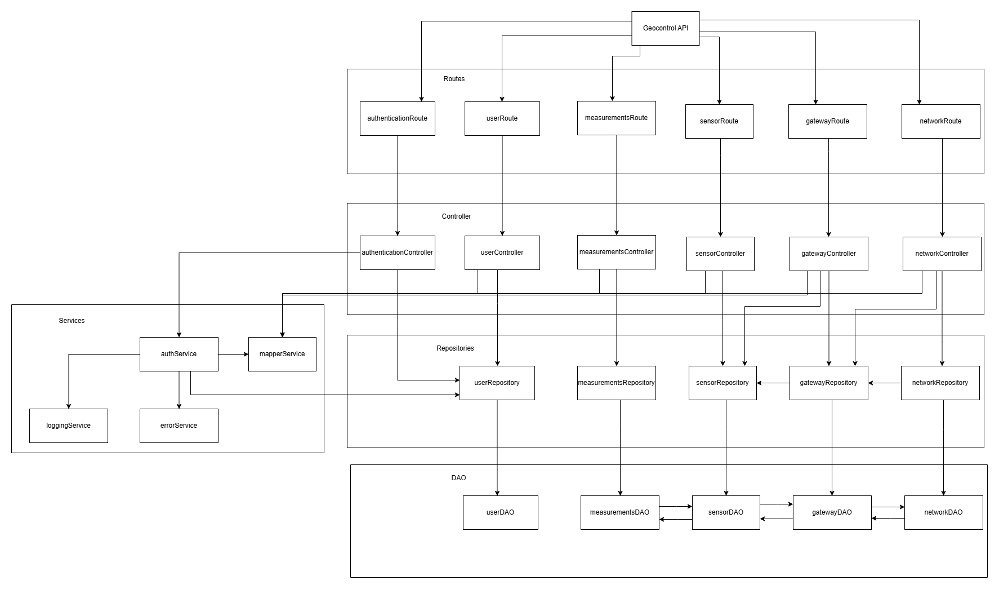

# Test Report

<The goal of this document is to explain how the application was tested, detailing how the test cases were defined and what they cover>

# Contents

- [Test Report](#test-report)
- [Contents](#contents)
- [Dependency graph](#dependency-graph)
- [Integration approach](#integration-approach)
- [Tests](#tests)
- [Coverage](#coverage)
  - [Coverage of FR](#coverage-of-fr)
  - [Coverage white box](#coverage-white-box)

# Dependency graph

# Integration approach

    The integration approach adopted during the testing phase is a **bottom-up** approach. 
      
    **User**: 
    
    Step 1: userRepository (unit test, with mock for database) 
     Step 2: userRepository + userController (integration test, with driver simulating API call)
     Step 3: userController + userRoute (integration test, with driver simulating API call) 
     Step 4: userController + userRoute (integration test, with mock database response)
      
    **Sensor**

    Step 1: sensorRepository (unit test, with mock for database) 
     Step 2: sensorRepository + sensorController (integration test, with driver simulating API call)
     Step 3: sensorController + sensorRoute (integration test, with driver simulating API call)  
     Step 4: sensorController + sensorRoute (integration test, with mock simulating database response) 
      
    **Gateway**

    Step 1: gatewayRepository (unit test, with mock for database) 
     Step 2: gatewayRepository + sensorRepository + gatewayController (integration test, with driver simulating API call and mock function simulating database requests of sensors)
     Step 3: sensorRepository + gatewayController + gatewayRoute (integration test, with driver simulating API call and mock functions simulating database response)
     Step 4: gatewayController + gatewayRoute (integration test, with mock function simulating database response)
      
    **Network**

    Step 1: networkRepository (unit test, with mock for database) 
     Step 2: networkRepository + networkController(integration test, with driver simulating API call)
     Step 3: networkRepository + networkController + gatewayRepository + sensorRepository + networkRoute (integration test, with driver simulating API call and mock simulating the database requests) 
     Step 4: networkController + networkRoute (integration test, with mock simulating the database response)
      
    **Measurement**  

    Step 1: measurementRepository (unit test, with mock for database) 
     Step 2: measurementRepository + measurementController (integration test, with driver simulating API call)
     Step 3: measurementController + measurementRoute (integration test, with driver simulating API call) 
     Step 4: measurementController + measurementRoute (integration test, with mock simulating database response) 

# Tests

<in the table below list the test cases defined For each test report the object tested, the test level (API, integration, unit) and the technique used to define the test case (BB/ eq partitioning, BB/ boundary, WB/ statement coverage, etc)> <split the table if needed>

| Test case name | Object(s) tested | Test level | Technique used |
| :------------: | :--------------: | :--------: | :------------: |
| create gateway                        | GatewayRepository (db+mock)  | Unit testing  | Mock DB, WB/statement |
| create gateway: wrong mac format      | GatewayRepository (db)       | Unit testing  | WB/branch             |
| create gateway: already existing error| GatewayRepository (db+mock)  | Unit testing  | Mock DB, WB/branch    |
| edit gateway                         | GatewayRepository (db+mock)  | Unit testing  | WB/statement          |
| edit gateway: wrong mac format        | GatewayRepository (db)       | Unit testing  | WB/branch             |
| edit gateway: mac already existing    | GatewayRepository (db)       | Unit testing  | WB/branch             |
| get gateway                          | GatewayRepository (db+mock)  | Unit testing  | WB/statement          |
| get gateway: not found                | GatewayRepository (db+mock)  | Unit testing  | WB/branch             |
| getAll gateway                        | GatewayRepository (db+mock)  | Unit testing  | WB/statement          |
| delete gateway                        | GatewayRepository (db+mock)  | Unit testing  | WB/statement          |
| create network                        | NetworkRepository (db+mock)  | Unit testing  | Mock DB, WB/statement |
| create network: conflict              | NetworkRepository (db+mock)  | Unit testing  | Mock DB, WB/branch    |
| get network by code                   | NetworkRepository (mock)     | Unit testing  | Mock DB, WB/statement |
| get network by code: not found        | NetworkRepository (db+mock)  | Unit testing  | Mock DB, WB/branch    |
| delete network                        | NetworkRepository (db+mock)  | Unit testing  | Mock DB, WB/statement |
| get all networks with gateways/sensors| NetworkRepository (db)       | Unit testing  | WB/statement          |
| update network name and description   | NetworkRepository (db)       | Unit testing  | WB/statement          |
| update network: not found             | NetworkRepository (db)       | Unit testing  | WB/branch             |
| create user                           | UserRepository (db+mock)     | Unit testing  | Mock DB, WB/statement |
| create user: conflict                 | UserRepository (db+mock)     | Unit testing  | Mock DB, WB/branch    |
| find user by username                 | UserRepository (mock)        | Unit testing  | Mock DB, WB/statement |
| find user by username: not found      | UserRepository (db+mock)     | Unit testing  | Mock DB, WB/branch    |
| delete user                           | UserRepository (mock)        | Unit testing  | Mock DB, WB/statement |
| create measurement                    | MeasurementRepository (db+mock) | Unit testing | Mock DB, WB/statement |
| create measurement: conflict          | MeasurementRepository (mock) | Unit testing  | Mock DB, WB/branch    |
| getAllSensorMeasurements: not found   | MeasurementRepository (mock) | Unit testing  | Mock DB, WB/branch    |
| getAllSensorMeasurements: found       | MeasurementRepository (mock) | Unit testing  | Mock DB, WB/statement |
| get all users                         | userRoutes, userController   | Integration   | API, WB/statement     |
| get all users: 401 UnauthorizedError  | userRoutes                   | Integration   | API, WB/branch        |
| get all users: 403 InsufficientRightsError | userRoutes               | Integration   | API, WB/branch        |
| get User: mapperService integration   | userController               | Integration   | Mock repo, WB         |
| GET /users (e2e)                      | Users API                    | E2E testing   | API, BB/equiv-part    |
| should return an empty array when no networks exist | Networks API      | E2E testing   | API, BB/equiv-part    |
| should require authentication         | Networks API                  | E2E testing   | API, BB/equiv-part    |
| POST /networks/:networkCode/gateways - create new gateway | Gateways API  | E2E testing   | API, BB/equiv-part    |
| POST /networks/:networkCode/gateways - viewer should be forbidden | Gateways API | E2E testing | API, BB/equiv-part   |
| GET /networks/:networkCode/gateways - get gateways | Gateways API      | E2E testing   | API, BB/equiv-part    |
| GET /networks/:networkCode/gateways/:gatewayMac - get a gateway | Gateways API | E2E testing | API, BB/equiv-part   |
| POST /sensors/:sensorMac/measurements - create new measurements | Measurements API | E2E testing | API, BB/equiv-part |
| POST /sensors/:sensorMac/measurements - viewer should be forbidden | Measurements API | E2E testing | API, BB/equiv-part |
| GET /sensors/:sensorMac/measurements - get measurements | Measurements API | E2E testing | API, BB/equiv-part   |
| GET /networks/:networkCode/measurements - get network measurements | Measurements API | E2E testing | API, BB/equiv-part |
| GET /networks/:networkCode/stats - get network stats | Measurements API | E2E testing | API, BB/equiv-part    |
| GET /networks/:networkCode/outliers - get network outliers | Measurements API | E2E testing | API, BB/equiv-part |
| get sensor measurements (route)        | measurementRoutes            | Integration   | WB/statement coverage |
| get sensor measurements: 401           | measurementRoutes            | Integration   | WB/branch coverage    |
| get sensor measurements: 403           | measurementRoutes            | Integration   | WB/branch coverage    |
| post sensor measurements (route)       | measurementRoutes            | Integration   | WB/statement coverage |
| get network measurements (route)       | measurementRoutes            | Integration   | WB/statement coverage |
| get network statistics (route)         | measurementRoutes            | Integration   | WB/statement coverage |
| get network outliers (route)           | measurementRoutes            | Integration   | WB/statement coverage |
| create measurement | MeasurementRepository | Unit testing | Mock DB, WB/statement |
| create measurement: conflict | MeasurementRepository | Unit testing | Mock DB, WB/branch |
| getAllSensorMeasurements: not found | MeasurementRepository | Unit testing | Mock DB, WB/branch |
| getAllSensorMeasurements: found | MeasurementRepository | Unit testing | Mock DB, WB/statement |
| createMeasurement (controller) | measurementController | Integration | Mock repo, WB |
| getSensorMeasurements (controller) | measurementController | Integration | Mock repo, WB |
| getSensorStatistics (controller) | measurementController | Integration | Mock repo, WB |
| getSensorOutliers (controller) | measurementController | Integration | Mock repo, WB |
| getNetworkMeasurements (controller) | measurementController | Integration | Mock repo, WB |
| getNetworkStatistics (controller) | measurementController | Integration | Mock repo, WB |
| getNetworkOutliers (controller) | measurementController | Integration | Mock repo, WB |
| POST /sensors/:sensorMac/measurements | Measurement E2E | E2E testing | API, BB/equiv-part |
| POST /sensors/:sensorMac/measurements forbidden | Measurement E2E | E2E testing | API, BB/equiv-part |
| GET /sensors/:sensorMac/measurements | Measurement E2E | E2E testing | API, BB/equiv-part |
| GET /networks/:networkCode/measurements | Measurement E2E | E2E testing | API, BB/equiv-part |
| GET /networks/:networkCode/stats | Measurement E2E | E2E testing | API, BB/equiv-part |
| GET /networks/:networkCode/outliers | Measurement E2E | E2E testing | API, BB/equiv-part |
| get sensor measurements (route) | measurementRoutes | Integration | WB/statement coverage |
| get sensor measurements: 401 | measurementRoutes | Integration | WB/branch coverage |
| get sensor measurements: 403 | measurementRoutes | Integration | WB/branch coverage |
| post sensor measurements (route) | measurementRoutes | Integration | WB/statement coverage |
| get network measurements (route) | measurementRoutes | Integration | WB/statement coverage |
| get network statistics (route) | measurementRoutes | Integration | WB/statement coverage |
| get network outliers (route) | measurementRoutes | Integration | WB/statement coverage |

# Coverage

## Coverage of FR

<Report in the following table the coverage of functional requirements and scenarios(from official requirements) >

| Functional Requirement or scenario | Test(s) |
| :-------------------------------: | :-----: |
|               FR1.1               |         |
|               FR2.1               |         |
|               FR2.2               |         |
|               FR2.3               |         |
|               FR2.4               |         |
|               FR2.5               |         |
|               FR3.1               |         |
|               FR3.2               |         |
|               FR3.3               |         |
|               FR3.4               |         |
|               FR3.5               |         |
|               FR4.1               |         |
|               FR4.2               |         |
|               FR4.3               |         |
|               FR4.4               |         |
|               FR4.5               |         |
|               FR5.1               |         |
|               FR5.2               |         |
|               FR5.3               |         |
|               FR5.4               |         |
|               FR5.5               |         |
|               FR6.1               |   3      |
|               FR6.2               |     3    |
|               FR6.3               |     3    |
|               FR6.4               |   5      |
|               FR6.5               |    4     |
|               FR6.6               |     2   |
|               FR6.7               |   2      |

## Coverage white box

Report here the screenshot of coverage values obtained with jest-- coverage
